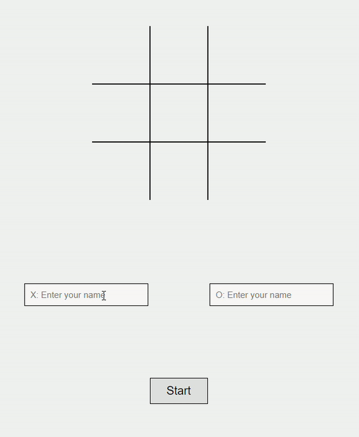

# Tic Tac Toe

For this project, I wanted to apply JS concepts such as closures and factory functions. This helped me organise my code better and also added modularity to it while maintaining a clear structure.

## Table of Contents

- [Overview](#overview)
- [Features](#features)
- [Installation](#installation)
- [Usage](#usage)
- [Modules](#modules)
- [License](#license)

## Overview

This project is a web-based Tic Tac Toe game that allows two players to play against each other. The game keeps track of the players' scores and allows for resetting the game board.



## Features

- Two-player gameplay
- Score tracking
- Reset functionality
- Responsive design
- Alternating starting player for each new game

## Installation

1. Clone the repository:
    ```sh
    git clone https://github.com/adrien-dimitri/tic-tac-toe.git
    ```
2. Navigate to the project directory:
    ```sh
    cd tic-tac-toe
    ```

## Usage

1. Open `index.html` in your web browser.
2. Enter the names of the players.
3. Click the "Start" button to begin the game.
4. Players take turns clicking on the cells to place their marks (X or O).
5. The game will announce the winner and update the scores.
6. Click the "Reset" button to start a new game.

## Modules

### GameBoard

Manages the state and operations of the tic-tac-toe game board.

- `getBoard()`: Gets the current state of the game board.
- `printBoard()`: Prints the current state of the game board to the console.
- `checkCell(pos)`: Checks if a cell is empty.
- `updateBoard(pos, player)`: Updates the game board at a specific position with the player's mark.
- `resetBoard()`: Resets the game board to its initial state.

### GameController

Manages the game logic and player interactions.

- `GameController(player1, player2)`: Initializes the game controller with two players.
- `playRound(pos)`: Plays a round by updating the board and checking for a winner.
- `getActivePlayer()`: Gets the active player.
- `endGame(isTie)`: Ends the game by updating the score and starting the next game.
- `isGameEnded()`: Checks if the game has ended.
- `startNewGame()`: Starts a new game by resetting the board and printing the new round.

### DisplayController

Handles the display and user interaction of the tic-tac-toe game.

- `startSession()`: Initializes the game session by setting up event listeners for the start and reset buttons.
- `startNextGame(msg)`: Displays an overlay announcing the winner of the game.
- `resetIsClicked()`: Resets the `isClickedArray` to all `false` values.
- `updateScore(p1, p2)`: Updates the displayed scores for both players.
- `updateBoard(board)`: Updates the game board display based on the current state of the board.
- `resetSession()`: Resets the game session and reinitializes the session.
- `highlightTurn(player)`: Highlights the name of the player whose turn it is.

## License

This project is licensed under the MIT License. See the [LICENSE](LICENSE) file for details.
